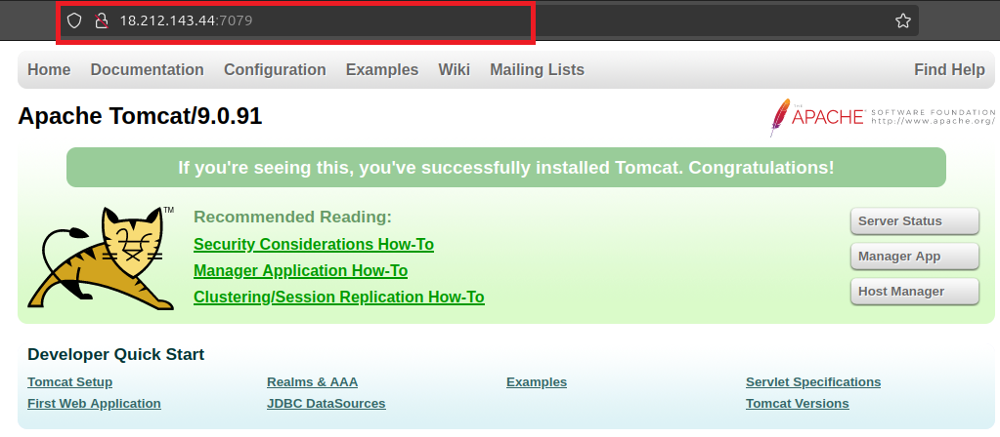

# Deploy_a_sample_tomcatapp_using_jenkins

How to deploy a sample tomcat application using jenkins......

1. First,create a one EC2 machine for jenkins dTeployment.I'm also attached a VPC service everthink.this take the machine is ubuntu 22.04.

   

2. Use putty for windows or ssh for ubuntu. Here,I'm used ssh client to login in EC2 machine.

   
   
   First,Install a java jdk on the machine
   
   

3. Then,Before install a jenkins ,you should add jenkins key and directory

   

4. Click a debian-stable repository to add a key & download jenkins.
   
   

5. After added a key,you should install a jenkins.
   
   

6. Check once your jenkins is working correctly or not.
   
   

7. Now , install apache tomcat on the machine. Here,I used apche tomcat 9.0.91

   

8. Check,a tomcat downloaded on your machine.Extract the tomcat .tar file

    sudo tar -xvzf apche-tomcat-9.0.91

9. Here,You should change a tomcat default port number.Because of jenkins & tomcat default port number is 8080.
   you can change any one default port number. Here,I changed tomcat port number as 7079.

   

10. Once,did you Changed a port number or tomcat server related operation ? ,you should restart the tomcat.

    

11. Now,you can try to access a jenkins machine using your IP:7079 with a port number.

    

12. we should a sample java based application code.So ,I download a sample application from the web.

    
    

13. The move the sample.war file to cd /var/lib/jenkins/webapps/deplot_a_application
    Above,the line I mentioned a my jenkins newstyle(deplot_a_application) project.

    1[Alt text](jen/11.png)

14. On my project ,in the post build action choose a deploy a continer & give the sample application details.

    

    

15. While you first time try this project,maybe you can face this error.

    

16. Just uncomment a below line into tomcat webapps

    
    

    If you changed anything,do not forget to restart a service

17. Now, You can run the jenkins job & check the console output

    
    
    
    
    
    
